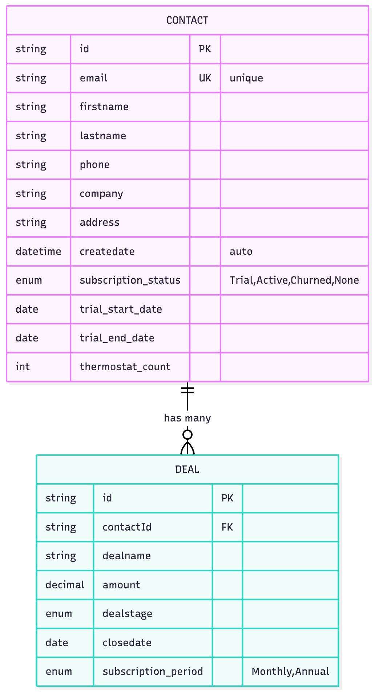
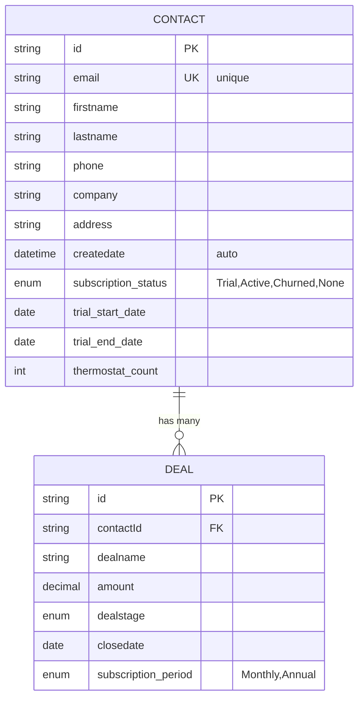

# Breezy HubSpot Integration POC

> A proof-of-concept demonstrating HubSpot CRM integration for Breezy's smart thermostat subscription platform

## Table of Contents

- [Project Overview](#project-overview)
- [Setup Instructions](#setup-instructions)
- [Testing the Integration](#testing-the-integration)
- [HubSpot Data Architecture](#hubspot-data-architecture)
- [AI Usage Documentation](#ai-usage-documentation)
- [Design Decisions](#design-decisions)

---

## Project Overview

This POC demonstrates how Breezy's platform would integrate with HubSpot to:

- **Sync customer data** when thermostats are purchased
- **Track trial-to-paid conversions** as deals
- **Enable marketing automation** based on customer lifecycle

### What This POC Demonstrates

| Feature | Description |
|---------|-------------|
| Contact Sync | Create contacts in HubSpot when customers purchase thermostats |
| Deal Tracking | Record subscription conversions as deals associated with contacts |
| Data Display | View synced contacts and their subscription status |
| Real-time Stats | Dashboard showing total contacts and subscriptions |

### Tech Stack

- **Backend**: Express.js + HubSpot API
- **Frontend**: Vanilla HTML/CSS/JavaScript
- **API**: HubSpot CRM API v3

---

## ⚙️ Setup Instructions

### Prerequisites

- Node.js v14+
- npm
- HubSpot account with API access

### Installation

1. **Clone the repository**

   ```bash
   git clone https://github.com/YOUR_USERNAME/hs-solution-architect-tech-assignment.git
   cd hs-solution-architect-tech-assignment
   ```

2. **Install dependencies**

   ```bash
   npm install
   ```

3. **Configure HubSpot access**

   - Log into your HubSpot account
   - Go to Settings → Integrations → Private Apps
   - Create a new Private App with these scopes:
     - `crm.objects.contacts.read`
     - `crm.objects.contacts.write`
     - `crm.objects.deals.read`
     - `crm.objects.deals.write`
   - Copy the access token

4. **Get Anthropic API key (optional - for AI Insights feature)**

   - Sign up at [Anthropic Console](https://console.anthropic.com/)
   - Navigate to API Keys section
   - Create a new API key
   - Copy the key (starts with `sk-ant-api03-...`)
   
   *Note: If you skip this step, the AI Insights feature won't work, but all other features will function normally.*

5. **Set up environment variables**

   ```bash
   cp .env.example .env
   ```

   Edit `.env` and add your tokens:

   ```
   HUBSPOT_ACCESS_TOKEN=your_token_here
   ANTHROPIC_API_KEY=your_anthropic_key_here
   ```

   **Note**: The Anthropic API key is optional. If not provided, the AI Insights feature will not be available, but all other features will work normally.

6. **Start the server**

   ```bash
   npm start
   ```

   You should see:

   ```
   Server running successfully!
   API available at: http://localhost:3001
   ```

7. **Open the application**

   Navigate to `http://localhost:3001` in your browser.

### Environment Variables

| Variable | Description | Required |
|----------|-------------|----------|
| `HUBSPOT_ACCESS_TOKEN` | HubSpot Private App access token | Yes |
| `ANTHROPIC_API_KEY` | Anthropic Claude API key (for AI insights feature) | Optional |

---

## Testing the Integration

### Test Flow: Customer Purchase → Trial → Conversion

**Step 1: Create a Contact (Simulate Thermostat Purchase)**

1. Fill in the "New Thermostat Purchase" form:
   - First Name: `Sarah`
   - Last Name: `Johnson`
   - Email: `sarah.johnson@example.com`
   - Phone: `555-123-4567` (optional)
   - Company: `Acme Inc` (optional)
2. Click "Create Contact & Sync to HubSpot"
3. Success message appears
4. Contact appears in the table below

**Step 2: Create a Deal (Record Subscription Conversion)**

1. In the "Record Subscription Conversion" form:
   - Select Contact: `Sarah Johnson (sarah.johnson@example.com)`
   - Subscription Name: `Breezy Premium - Annual Subscription`
   - Plan: `Annual ($99/year)`
   - Amount: Auto-fills to `99`
   - Deal Stage: `Closed Won (Converted to Paid)`
2. Click "Create Subscription Deal"
3. Success message appears
4. Deal appears under contact in the table

**Step 3: Verify in HubSpot**

1. Click "View in HubSpot →" link next to the contact
2. Confirm contact exists in HubSpot portal
3. Check associated deal in contact record

### Expected Results

| Action | Expected Outcome |
|--------|------------------|
| Create contact | Contact appears in table, synced to HubSpot |
| Create deal | Deal shows under contact with amount and stage |
| Refresh | Data reloads from HubSpot API |
| View in HubSpot | Opens contact record in HubSpot portal |

---

## HubSpot Data Architecture

### Entity Relationship Diagram



*Interactive diagram below (renders on GitHub):*



### Data Model Explanation

#### Contact Object (Customer)

The Contact object represents a Breezy customer who purchased a thermostat.

| Property | Type | Standard/Custom | Purpose |
|----------|------|-----------------|---------|
| `id` | string | Standard | HubSpot unique identifier |
| `email` | string | Standard | Unique business key |
| `firstname` | string | Standard | Customer first name |
| `lastname` | string | Standard | Customer last name |
| `phone` | string | Standard | Contact phone |
| `company` | string | Standard | Customer's employer (optional) |
| `address` | string | Standard | Shipping/billing address |
| `createdate` | datetime | Standard | When contact was created |
| `subscription_status` | enum | Custom | Trial, Active, Churned, None |
| `trial_start_date` | date | Custom | When 30-day trial began |
| `trial_end_date` | date | Custom | When trial expires |
| `thermostat_count` | number | Custom | Devices owned (expansion tracking) |

#### Deal Object (Subscription)

The Deal object represents a subscription conversion event.

| Property | Type | Standard/Custom | Purpose |
|----------|------|-----------------|---------|
| `id` | string | Standard | HubSpot unique identifier |
| `contactId` | string | Standard | Associated contact (FK) |
| `dealname` | string | Standard | Subscription description |
| `amount` | decimal | Standard | Revenue value |
| `dealstage` | enum | Standard | closedwon, closedlost |
| `closedate` | date | Standard | When deal closed |
| `subscription_period` | enum | Custom | Monthly or Annual |

### Design Rationale

**Why Contact + Deal (not just Contact)?**

- **Contact** = Persistent customer entity (exists for lifetime)
- **Deal** = Transactional revenue event (one per subscription conversion)
- Enables tracking: initial conversion, renewals, revenue over time
- Standard HubSpot pattern for subscription businesses

**Why no Deal for trial?**

- Trial is $0 revenue → would inflate deal counts
- Trial status tracked via Contact properties instead
- Cleaner revenue reporting (all deals = real revenue)
- Deal created only on paid conversion

**Why 1:N relationship?**

Customer lifecycle creates multiple deals over time:

```
Contact: sarah@example.com
  ├── Deal 1: "Annual Sub 2024" ($99) - Initial conversion
  ├── Deal 2: "Annual Renewal 2025" ($99) - Renewal
  └── Deal 3: "Annual Renewal 2026" ($99) - Renewal
```

### Custom Properties Rationale

| Property | Why It's Needed |
|----------|-----------------|
| `subscription_status` | Segment customers for targeted campaigns (Trial vs Active vs Churned) |
| `trial_start_date` | Enable "trial ending soon" automated workflows |
| `trial_end_date` | Trigger conversion reminders at day 25, 28, 30 |
| `thermostat_count` | Identify expansion opportunities (multi-device households) |
| `subscription_period` | Distinguish Monthly ($9.99) vs Annual ($99) for revenue analysis |

### Deal Pipeline Architecture

**Pipeline Name**: Breezy Premium Subscriptions

| Stage | Internal Name | Probability | Description |
|-------|---------------|-------------|-------------|
| Trial Active | `appointmentscheduled` | 30% | Customer in 30-day trial |
| Trial Ending Soon | `qualifiedtobuy` | 60% | < 5 days remaining |
| Closed Won | `closedwon` | 100% | Converted to paid |
| Closed Lost | `closedlost` | 0% | Trial expired, no conversion |

---

## AI Feature: Customer Insights Generator

### What It Does

Analyzes customer data and provides actionable marketing recommendations powered by Claude AI (Anthropic).

**Click "AI Insights" on any contact to get:**
- **Marketing Segment** - Which campaign bucket they belong to
- **Current Status** - Brief assessment of where they are
- **Recommended Action** - Specific next step with timing
- **Expansion Potential** - Likelihood to purchase additional thermostats

### Why This Feature?

Breezy asked: *"Show us one way AI could help us be smarter about our customer data."*

This feature directly addresses their business needs:

| Business Need | How AI Addresses It |
|---------------|---------------------|
| "Create targeted marketing campaigns" | AI recommends which specific campaign to send |
| "Based on hardware ownership and subscription status" | AI analyzes all contact properties and deals |
| "Identify expansion opportunities" | AI flags multi-thermostat potential based on company data |
| "Be smarter about customer data" | Transforms raw data into actionable insights |

### Example Output

```
AI Customer Insights

Segment: Trial User - High Intent

Status: Customer created account recently with no subscription yet

Recommended Action:
Send "Welcome & Trial Benefits" email campaign within 48 hours.
Highlight energy savings calculator and remote access features.

Expansion Potential: Medium 
Reason: Has company listed (Acme Inc) - possible multi-unit or 
office installation opportunity. Consider B2B outreach.
```

### Technical Implementation

- **Model**: Claude 3 Haiku (fast, cost-effective for real-time analysis)
- **Endpoint**: `POST /api/ai/insights`
- **Input**: Contact properties + associated deals
- **Output**: Structured JSON with segment, action, and expansion score
- **Latency**: ~1-2 seconds per analysis

### When to Use AI vs Traditional Rules

| Scenario | Use AI | Use Rules |
|----------|--------|-----------|
| Nuanced recommendations requiring context | ✅ | |
| Natural language insights for humans | ✅ | |
| Pattern recognition across multiple factors | ✅ | |
| Simple if/then logic (e.g., trial expired?) | | ✅ |
| Binary flags (e.g., has subscription?) | | ✅ |
| High-volume, low-latency operations | | ✅ |

### Business Value

1. **Saves Time**: Marketing team doesn't manually segment customers
2. **Increases Conversions**: Timely, personalized recommendations
3. **Identifies Revenue**: Flags expansion opportunities automatically
4. **Scalable**: Analyzes unlimited customers instantly

---

## AI Usage Documentation

### Tools Used

| Tool | Purpose |
|------|---------|
| Cursor AI | AI-powered code editor with integrated Claude |
| Claude (Anthropic) | Architecture planning, code review, documentation |
| GitHub Copilot | Code completion and suggestions |

### Tasks Completed with AI

| Task | Tool | Time Saved |
|------|------|------------|
| Architecture planning & ERD design | Cursor + Claude | ~45 min |
| HTML/CSS structure | Cursor + Copilot | ~30 min |
| JavaScript async patterns | Cursor + Copilot | ~20 min |
| AI insights feature implementation | Cursor + Claude | ~25 min |
| README documentation | Cursor + Claude | ~30 min |
| Debugging API issues | Cursor + Claude | ~15 min |

### What I Learned

1. **HubSpot API specifics**: Custom properties must be created in portal before API accepts them
2. **Deal associations**: Use contact IDs (not emails) for deal-to-contact links
3. **Async patterns**: Promise.all() for parallel API calls improves UX
4. **Data modeling**: Importance of separating customer entity (Contact) from revenue events (Deal)

### How AI Helped

**Strengths:**

- Rapid prototyping (reduced development time by ~50%)
- Best practices for HubSpot integration patterns
- Documentation structure and clarity
- Debugging obscure API error messages

**Limitations:**

- Required verification against HubSpot docs for API specifics
- Business decisions (trial strategy, data model) required human judgment
- Some suggestions needed adaptation for this specific use case

### AI vs Traditional Approach

| Scenario | Better Approach |
|----------|-----------------|
| Boilerplate code | AI (faster) |
| API integration patterns | AI (knows best practices) |
| Business logic decisions | Human (context required) |
| Data model design | Collaborative (AI suggests, human decides) |
| Error handling edge cases | Human (domain knowledge) |

---

## Design Decisions

### Technical Choices

| Decision | Choice | Rationale |
|----------|--------|-----------|
| Framework | Vanilla JS | Faster POC, no build step, assignment allows any |
| Architecture | Single HTML file | Easy to demo, no dependencies |
| Styling | Custom CSS | HubSpot-inspired design, no external libraries |
| API calls | Fetch API | Native browser support, no dependencies |

**Production alternative**: Would use React + TypeScript for maintainability and type safety.

### UX Decisions

| Decision | Choice | Rationale |
|----------|--------|-----------|
| Trial activation | Automatic | Matches Breezy's business model ("trial with every purchase") |
| Plan selection | Auto-fills amount | Reduces errors, improves UX |
| Loading states | Per-section | Better perceived performance |
| Deal display | Inline with contact | Shows relationship clearly |

### Assumptions Made

1. **Email is unique identifier** - One customer per email address
2. **One subscription per customer** - Not family/multi-user plans
3. **Trial always 30 days** - Starts immediately on purchase
4. **Real-time sync acceptable** - Not batch processing (< 1000 orders/day)
5. **B2C focus only** - Per assignment, B2B distributor not in scope

### What I'd Improve With More Time

| Improvement | Benefit |
|-------------|---------|
| Implement custom properties | Enable trial tracking workflows |
| Add email validation | Prevent duplicates, improve data quality |
| Retry logic for API failures | Better reliability |
| Unit and E2E tests | Confidence in changes |
| Pagination for contacts | Handle larger datasets |
| AI-powered churn prediction | Proactive retention |

### Questions for Client Before Production

1. **Data Sources**: What e-commerce platform? (Shopify, custom?) What subscription system? (Stripe, Chargebee?)
2. **Sync Strategy**: Real-time webhooks or batch sync? Volume expectations?
3. **Duplicates**: How to handle existing customers who re-purchase?
4. **Multi-device**: One subscription per household or per thermostat?
5. **Historical Data**: Migration needed for existing customers?
6. **Compliance**: GDPR/CCPA data handling requirements?

---

## Project Structure

```
hs-solution-architect-tech-assignment/
├── public/
│   └── index.html           # Frontend application
├── .env.example             # Environment template
├── .gitignore               # Git ignore rules
├── package.json             # Dependencies
├── README.md                # This file
└── server.js                # Express backend
```

---

## Future Enhancements

### Phase 2: Production Ready

- Webhook integration (auto-sync on purchase)
- Custom HubSpot properties implementation
- Error retry with exponential backoff
- Comprehensive logging

### Phase 3: AI Features

- Churn risk prediction based on usage patterns
- Smart customer segmentation
- Personalized conversion messaging
- Expansion opportunity scoring

---

## Contact

Built for HubSpot Solutions Architect Technical Assessment

Questions? Contact: Naomi Awoleye (nawoleye@hubspot.com)
